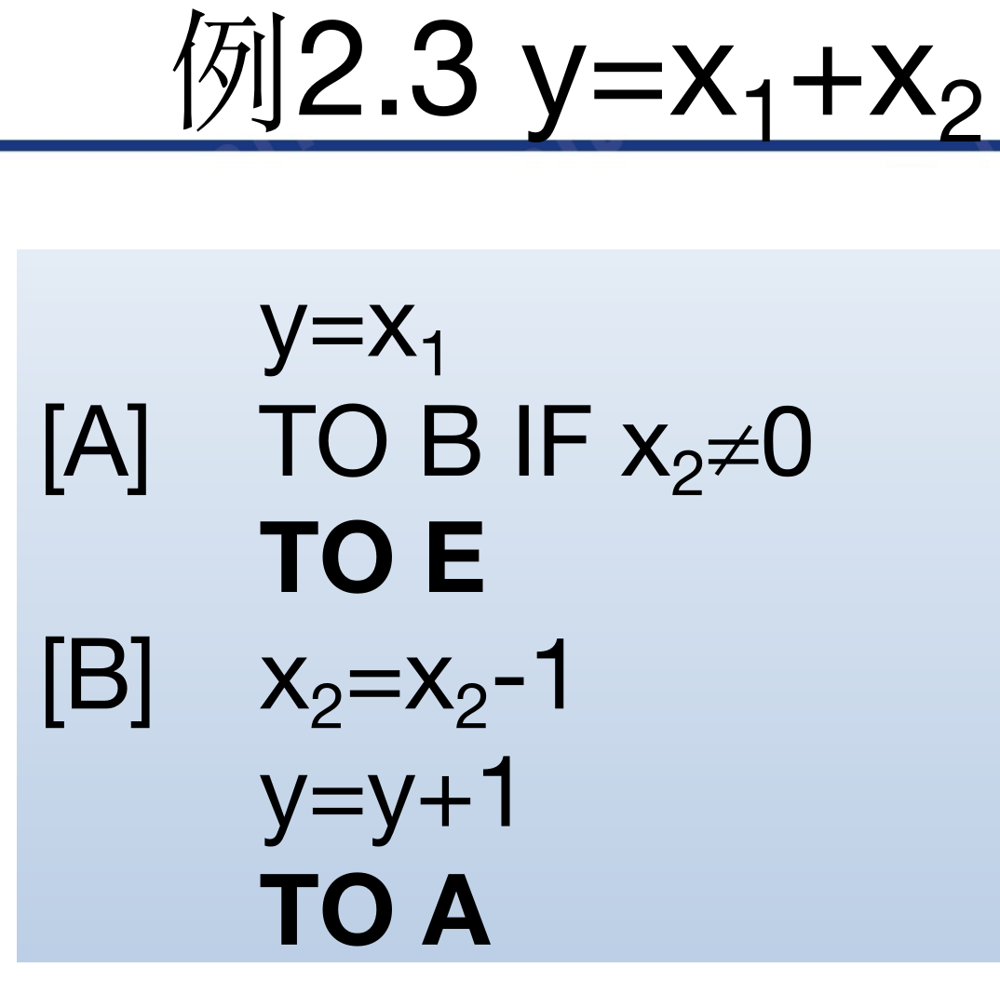
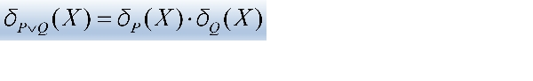
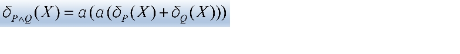

原语言基本语句   
`blue:自增、自减、条件转移 TO A IF X != 0、无条件转移 TO A、赋值 y = x`    
注意！x = 1 好像是非法指令！可以用 x = x + 1 代替   
除输入变量之外的其他变量初值为 0  
  
程序是用来定义函数的一种方式，即`red:用程序来定义函数`   

初始函数   

| 函数 | 定义 |
:--- | :--- 
后继函数	|	S(x) = x + 1
零函数		|	n(x) = 0
投影函数 |    **感觉后来就用不到了啊**
考考你：`yellow:什么是正则函数`  
每个谓词 P都有特征函数  
谓词 P 是否是原始递归的、是否是可计算的，与 P 的特征函数一致。  
  
  
**原始递归谓词的交、并、反都是原始递归谓词  **   

