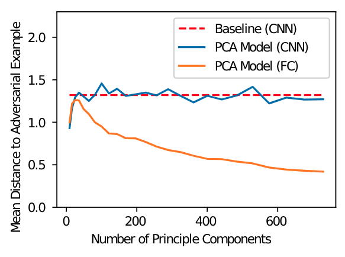

[TOC]

brown:主线
orange:不懂/存疑

# Adversarial Examples Are Not Easily Detected:Bypassing Ten Detection Methods
- **摘要** 已知神经网络容易受到对抗性样本的攻击：输入接近自然输入但分类错误。为了更好地理解对抗性例子的空间，我们提供了十个旨在检测和比较其有效性的最新建议。我们证明，通过构造新的损失函数可以克服一切（攻破一切防御）。我们得出的结论是，对抗性示例比以前意识到的要难得多，并且事实上，对抗性示例所固有的属性实际上并没有。最后，我们提出了一些简单的准则来评估未来提出的防御措施
- - - - - -- 
单词解释
- distortion（失真）：图像扭曲程度。失真越小图像越清晰、真实。

- - - - - -- 

## 架构
对手生成 *对抗样本* ，欺骗 *分类器* （神经网络），而分类器装配了 *检测器* ，用来检测样本是否是生成的对抗样本（而不是自然样本）。
- - - - - -- 
**研究对象**：用于图像分类的神经网络。  
**本文目的：研究各种防御机制是否有效**。  

  
> 上图：MNIST和CIFAR数据集上针对我们研究的每种防御生成的对抗样本。第一行对应于原始图像。

本文反对"对抗样本与自然图像具有内在差异的假设"  

1. 不采取措施的通用攻击
2. 白盒攻击，有针对性
3. 可转移

## 符号定义
$F(·)$ : 神经网络分类器
${F(x)}_i$  : 预测分类为第 i 类的概率
$F^i(x) = RELU(A^i·F^{i-1}(x) + b)$ : 第 i 层输出
$Z(x) = F^n(x)$ : 最后一层（第 n 层）输出
$F(x) = softmax(Z(x))$ : 神经网络的最终输出（因为 Z(x)还要经过神经网络的唯一终极 softmax 层处理为概率形式）
$C(x) = arg &thinsp; max_i(F(x)_i)$ ： $F(·)$在对x 上给出的分类。  

神经网络很**健壮**意味着很难在其上找到对抗性例子  
对对抗示例进行正确分类很难，因此现在的对抗防御（defense）转而去做检测对抗示例并拒绝他们。`我感觉"拒绝"就是 拒绝对他们进行分类，傲娇~`

三种模型
- zero-knowledge攻击：什么也不知道
- perfect-knowledge 攻击：知道神经网络被检测器 D 保护，且知道 D 的模型参数
- limited-knowledge 攻击：知道神经网络被检测器 D 保护，但不能访问经过训练的检测器 D   

## 生成对抗样本   
Carlini 和 Wagner（**C&W**）使用 $L_2$攻击算法去生成**目标对抗样本**（定向攻击）:   
给定神经网络的$logits &thinsp; Z$，攻击使用梯度下降进行：   
$minimize ||x' -  x||_2^2 + c·l(x')$   
损失函数$l$定义为：   
$l(x') = max(max[Z(x')_i:i \neq t] - Z(x')_t, -k)$   
其中，$x'$是待训练的对抗样本，x 是自然样本。mine:min公式前半段目的是减少失真（让$x'$和$x$看起来更接近），后半段是让$x'$能骗过鉴别器。

$k = 0$ 时，对抗样本被称为 *低置信度样本* ，它直接被分为目标类。$k \neq 0$时，对抗样本被称为 *高置信度样本* ，分类器在将它分类时更自信。  
**Q**：为什么k 可以调节模型分类器对对抗样本的置信度？  
**A**：~~当 k 增加时，如-k = -1000 时，$l(x')$若只有$-k$则暗示损失值非常低（是负数，-1000），如果真实的$l(x')$仍然是负数，说明非目标类的最大概率值与~~  
`red:懂了`   

## 实施攻击
用三种攻击方式（前文有述）攻击防御方。  
`blue:猜测`adaptive attack（自适应攻击）：是指 x' = x + $\alpha \nabla$中的$\alpha$不是固定的。  

### 自适应的白盒攻击
`green:重点`构造损失函数，其可以生成对抗样本。  

### limited-knowledge 的黑盒攻击  
对手知道防御的类型但不知道检测器的参数。   
> 作者认为 limited-knowledge 攻击是黑盒攻击。其实挺对的我感觉。   

攻击方法：训练和待攻击模型相似的代理模型，通过对代理模型发动白盒攻击从而生成对抗样本，再将其转移给原始模型即可。

## 评估防御措施
`orange:存疑`second classifier 好像是指分类器和检测器二合一的分类器。
$F(·)$是分类网络
$D(·)$是检测网络
$sigmoid(D(x)) \in  [0,1] $ 表示实例（instance）是对抗样本的概率。

### 第一种检测（防御）方法    
构建一个 second classifier 来检测对抗样本  

#### 两种防御方法
##### 1.对抗再训练     
**对抗再训练**  (Adversarial Retraining)       
 ** Grosse ** 等提出了新思路：

| 传统方法 | 新方法 |
:---: | :---:
把对抗样本及其标签加入训练集训练，使分类器将其正确分类 | 引入第 N+1 类，该类表示对抗样本类  

流程如下：  
  
`pink：总结`先训练好模型，在该模型上生成对抗样本，将对抗样本集和原样本集加入数据集里，再次训练模型即可。**对抗再训练**可以识别出输入样本是否为对抗样本（ *即第 N+1 类样本* ）
$F_{secured}$是一个(有)防御(能力的)模型，既能够对输入样本进行正确分类，也能够识别出输入样本是否为对抗样本（这就是防御的含义啊！）

##### 2.构建二元分类器     
&#xE0020; **Gong** 等提出了类似的方法： **构建二元分类器 D** （`我感觉从功能上讲它就是鉴别器`），自然样本标记为 1，对抗样本标记为 0。训练集如下：   
  
`red:注意`其本质还是**对抗再训练**，把混合后的样本集放入原来训练好的基础模型$F_{base}$上训练出最终的模型。
结果发现，在 FGSM 和 JSMA 攻击（比 **C&W**弱）时，**对抗再训练**可以检测出对抗样本！厉害！

`brown:主线`
#### zero-knowledge 攻击评估    
在 zero-knowledge 攻击评估（识别）中，我们用 **MNIST** 数据集训练上述两种防御模型，使用**C&W**的攻击方式生成对抗样本，看看上述两种防御技术能否识别出对抗样本。   
我们给**MNIST**的每个图像都生成一个对抗样本，上述两种防御技术都能很好的识别出对抗样本（98%左右的准确度）。    
**但是，上述两种防御技术在 CIFAR 数据集上失败**     

`orange ：问题`"进一步调查发现，即使我们训练使用无目标攻击生成的对抗示例，这两种方案也都可以检测到目标对抗示例"  什么意思？？？  

`brown:主线`    
#### perfect-knowledge 攻击评估     
假设对手知道上述两种防御方法及其参数，**结果表明防御无法抵挡 perfect-knowledge 攻击**。  

之前我们做了在$F_{base}$（基础模型）上生成对抗样本的事情。现在我们在$F_{secured}$(防御模型)上再生成对抗样本，看看会发生什么。结果表明，**在$F_{secured}$上还是能够生成对抗样本，生成成功率并不比在$F_{base}$上的低**。唯一的区别是在前者上生成的样本的失真程度（肉眼看起来的扭曲程度）要比后者高 10%。  

##### **攻破 Gong 等的"构建二元分类器"防御方法**
定义一个 $G(·)$函数整合前面的分类器$F$和鉴别器$D$：  
  
其中$Z_F$是分类器$F$的最后一层输出，即还没经过 softmax 层（上面说过函数$Z(x)$的定义），$Z_D$是鉴别器$D$的最后一层输出。  
- 当对抗样本被 $D$识别为恶意示例时（$Z_D(x) > 0$），有：
- 当对抗样本被 $D$识别为自然示例时（$Z_D(x) < 0$），有：   
`orange:不懂`~~这样做的目的是 1、为了构建能同时愚弄$F_{base}$和$D$的对抗样本；2、让 G 有线性性质，使得某情况下的计算成为可能~~为了生成能够代替 logits 层($Z(x)$)的$G(x)$层。这句话只是表明原因，继续看。    
> 这个$G(x)_i$和$Z_F(x)_i$很类似，基本上是给出样本$x$经过 $NN$ 后的输出（尚未经过 $softmax $层）   

 **攻破 Gong 等防御方法的攻击方法：**     
用$G(x)$替代$Z(x)$输入到 **C&W**的对抗样本生成方法中，就能产生 100%成功欺骗 Gong 等的防御方法的对抗样本了！`yellow:$G(x)$里蕴含了鉴别器的信息$Z_D(X)$(即 perfect knowledge)，所以它才这么有效！`   
这些对抗样本的平均$L_2$失真比未受保护的方法高 10%（挺好的了）。
上面👆这句话什么意思？
1. 虽然我们能成功攻破 Gong 等的防御模型，但是相对于攻击未受保护的模型，在前者模型上生成的对抗样例人眼看起来会稍微有些扭曲。但扭曲程度也就提升了 10%，挺好的了。
2. 讲一下这个流程到底是怎么回事，懂了可以跳过：有一个分类器模型， **C&W**想攻击他，所以在该模型上生成对抗样本，这样就可以（定向）欺骗这个模型了。注意，在 **C&W**的方法中，是需要知道被攻击模型的内部信息的，比如用到的Z(x)就是该模型最后一层的输出（第 n 层F^n(x)）。后来 Gong 等提出了防御方法，效果挺好。为了攻破 Gong，就有了上述的 *攻破 Gong 等防御方法的攻击方法* 。  
`blue:总结`这说明上述两种防御方法（Grosse、Gong）至少在 MNIST 上都不行。在 CIFAR 上结论相似，甚至失真更少了（说明攻击方实在是太狡猾太强大了！perfect-knowledge 的白盒攻击无敌。）   
`brown:主线`     
#### limited-knowledge 攻击评估      
攻击 Grosse 的防御模型（Gong 同理）。     
把数据集分为两份，在这两个子数据集上生成 *两个检测（detector 模型，防御模型）模型*  **R1 ** 和 **R2**。我们给攻击者白盒权限用于访问 R1 模型的全部参数，并把 R2 作为(待攻击的)防御模型。   
**ps:注意 R1 和 R2 都是防御模型，只不过对手只知道 R1 的全部参数。**
我们使用 **C&W**在 R1 上生成对抗样本，然后将其 **传递** 到 R2 上看是否能将其愚弄。    
`purple:这👆就是标准的可传递性测试`     
~~👴上面👆说的对吗？"(￣┏Д┓￣°*)"     ~~    👴说的对    
把上述攻击应用在 unsecured基线模型(👴感觉就是未经过防御训练的$F_{base}$模型)上，攻击成功率是 98%。用同样的对抗样本去攻击 Grosse防御训练后的 secured模型，攻击成功率还是 98%，失真率也没高太多，这说明 Grosse 防御是无效的。即使攻击者不知道目标模型的确切参数，它还是能够攻击成功（使用了代理模型）。   

**小结**    

|  | zero-knowledge 攻击评估 | perfect-knowledge 攻击评估 | limited-knowledge 攻击评估 |
--- | --- | --- | ---
Grosse 防御 | 在MNIST上成功，在CIFAR上失败 | C&W在其(Grosse)生成的防御模型上仍能以高成功率生成对抗样本 | C&W 攻击方法将其攻破
Gong 防御 | 同上 | 被人用一种针对其专门设计的生成对抗样本的攻击方法攻破 | 同上    

### 查看卷积层检测（防御方法）    

| 先前的检测对抗样本的工作 | Metzen[^Metzen] 等的检测对抗样本的工作 |
--- | ---
根据图像本身的内容来检测对抗样本 | 着眼于网络的内部卷积层来检测对抗样本   

[^Metzen]:原始论文：On Detecting Adversarial Perturbations. InInternational Conference on LearningRepresentations   

`green:不太懂卷积`"他们使用检测神经网络扩充了分类神经网络，该检测神经网络从分类网络的各个中间层获取输入。该检测网络的训练方法与上述Gong的防御方法相同。"  "我们通过将检测器附加到第一个残差块的输出上来训练它。"    
>  Gong 的训练是把自然样本集和对抗样本集混合在一起放入之前仅用自然样本集来训练出来的模型上去训练检测器，那我想上述的检测网络应该是先用 emmmmmm👴不会了`blue: 不会`

对于简单攻击（FGSM 和 JSMA）效果不错，检测成功的概率为 99%。    
#### zero-knowledge 攻击评估    
训练检测器非常困难并且高度敏感。   
使用 C&W 进行攻击，结果显示该检测器获得 81%真阳性率和 28%假阳性率(即检测器认为是对抗样本的样本中有 28%不是对抗样本)   
`orange：问题`什么叫"即使对手未试图逃避防御，该防御也无法正常执行"？？？   
`white：已解决`~~C&W 攻击真的是黑盒（zero-knowledge）的吗？C&W 需要的$Z(x)$不是被攻击模型神经网络的最后一层输出吗？这不还是得知道被攻击模型的信息嘛！   ~~  
`lightyellow:C&W 是黑盒攻击。这里要区分分类器和鉴别器。所谓黑盒白盒是指对手是否知道鉴别器的信息，分类器的参数信息是默认被对手知道的。所以 Z(x)（具体来说是$Z_F(x)$）本来对手就知道。`
`lightyellow:在上文 *攻破 Gong 等防御方法的攻击方法* 中，这个方法就是白盒攻击。因为$G(·)$利用了$Z_D(x)$，这是**鉴别器**的 logits 层!`

#### perfect-knowledge 攻击评估     
perfect-knowledge 攻击击溃防御：生成的对抗样本被 $F_{base}$误分类，且逃避了鉴别器的检测。    
**攻击方法**：使用攻击Gong 模型时用到的$G(·)$函数，代替$Z(·)$函数输入到 C&W 的生成对抗样本的方法模型中去，以此来生成对抗样本。(其实和攻击 Gong 模型的方法一样)。    
失真程度提升了 34%，但作者说"从绝对意义上讲，生成的对抗样本和原始输入没有区别。"
> 这么说没道理啊，感觉作者在狡辩 23333   

#### limited-knowledge 攻击评估      
使用之前说过的标准的可传递性测试，把数据集分为两份，训练两个检测器模型，第一个模型被对手完全了解（白盒），对手要攻击的是第二个模型。     
在 MNIST 上， *即使是低置信度的对抗样本* ，在两个模型之间转移成功率也达到了 84%（即第一个模型的低置信度的对抗样本有 84%也能欺骗第二个模型）。通过两个方法可以提高攻击成功率到 98%：1、使用高置信度的对抗样本（置信度越高，说明模型越相信这个对抗样本是自然样本）；2、以增加平均失真(到 28%)为代价（作者说这个程度的失真无关痛痒）     
**总结**   

|  | 查看卷积层 |
:---: | :---:
zero-knowledge 攻击 | 训练检测器很困难，且效果不太好，假阳性率较高  
perfect-knowledge 攻击 | 防御直接被击溃，防御模型仍把对抗样本误分类，检测器(鉴别器)的检测被逃避
limited-knowledge 攻击 | 被"标准的可传递性测试"所（比较强力的）击败    

### 主成分分析检测（防御方法）  

> 主成分分析方法（PCA），是一种使用最广泛的数据降维算法。PCA的主要思想是将n维特征映射到k维上，这k维是全新的正交特征也被称为主成分，是在原有n维特征的基础上重新构造出来的k维特征。    

直觉：对抗样本比自然样本更频繁地使用更大(应该是指主成分的编号大吧)的主成分。所以检查使用的主成分即可检测出对抗样本。   
#### zero-knowledge 攻击评估  
  
  
当主成分（编号）逐渐变大时，对抗样本的得分变化不大，而自然样本的却急剧下降。据此可以区分对抗样本和自然样本。     
**注意，PCA 检测和之前的检测方法有些不同。有别于让模型把样本分为第 N+1 类或者输出 1（0 表示自然样本），PCA 检测是把训练集和待检测的测试集的 *主成分得分* 画在一张表上，若两者图像不重合且差异较大，说明测试集是包含对抗样本的。**    

自然数据（MNIST图像）边界像素几乎都为 0(从图片上就能显而易见)，而对抗示例边界像素稍微为正。因此最后一个主成分主要集中在这些边界像素上（即：他们是区分用的特征）。    
**总结**   

|   | PCA 检测 |
:---: | :---:
方法 | 通过在比较待测试的测试集的主成分得分与训练集的主成分得分作比较，从而检测出对抗样本
结论 | PCA (防御)检测是对 MNIST 特有的，在 CIFAR 上就无效，不具有普遍有效性
原因 | MNIST 上，对抗样本的边界值为 1 并不是其（对抗样本）的内在属性   

#### perfect-knowledge 攻击评估    
直接击溃防御。甚至生成**只更改前 K 个主成分**的对抗样例，即可欺骗鉴别器。   

### 降维（防御方法）    
**方法**：将 N 维输入（W·H·C，如 MNIST 上为 784）降为 k 维输入，在 k 维输入上训练分类器。   
`orange：问题`"PCA失去了空间局部性，因此无法使用卷积网络"是什么意思？
**直觉**：对抗样本比自然样本更频繁的使用更大的（后面的）主成分，则将主成分从 N维限制为前 K 维时，会让攻击者 *增加很大的失真* 以生成对抗样本（增加攻击者的代价）。因为对抗样本在后 N-K 维上的信息不会被 （k维）分类器接收，只能在前 k 维上做文章。 
**mine：**降维可能会起到防御效果，但也一定会降低模型准确度。    

#### perfect-knowledge 攻击评估   
构建定向攻击。然后绘图如下：   
   
**图片解读：**  
`orange：存疑`纵坐标我的理解是：在分类模型眼中，样本们距对抗样本的平均距离，这个值越小，说明模型认为自然样本和对抗样本差异越小（即越容易被攻击成功）。   
横坐标是模型使用的主成分的数量。每个模型使用的主成分数量都不同，然后把所有模型使用的主成分数量作为横坐标，模型的鲁棒性作为纵坐标，描点绘图得到上图。
1. 在降维后可以看到：仅使用前25 个主成分的模型（橙色线高峰）的鲁棒性（**鉴别对抗样本的能力**）要比保留所有 784 个主成分的模型（橙色线右侧最低点）强 3 倍。   
2. 即使是<仅使用前25 个主成分的降维模型>也比<什么也不改动的标准的 CNN（卷积 NN）>在鲁棒性上要差一些。   
**结论：**降维后训练的模型的鲁棒性比标准的 CNN 还要差，**所以说明**降维防御无法抵抗白盒攻击。   
**注意：**   
1、降维是**防御**方法，不是**检测器**，它是通过修改原始模型的输入维度来达到对对抗样本具有鲁棒性的目的。   
2、橙色线对应的模型是全连接 NN而不是 CNN，**虽然**在全连接 NN 上输入的主成分越少对对抗样本的鲁棒性越强，但是即使是全连接 NN 上最好的效果仍然比 CNN 的标准效果要差。所以才说降维防御无法抵抗白盒攻击。  

**深入思考：**该结论不仅仅是因为全连接 NN 不如 CNN 鲁棒性强。我们在 CNN 下使用 PCA 技术，来训练 CNN。使用PCA将每个图像映射到降维的PCA空间，然后立即将其映射回图像空间，在投影图像上训练卷基分类器。如下图：   
`orange：问题`所以上面👆这段话难道不是说明"该结论仅仅是因为全连接 NN 不如 CNN 鲁棒性强"吗？？？在 CNN 下使用 PCA 比不使用强，而使用 PCA 的全连接 NN 还是干不过标准 CNN，这难道不是说明了全连接 NN 不如 CNN 鲁棒性强吗？？？
   
`orange：存疑`
> 像上图那样一番折腾的目的，我觉得是为了控制变量，对比使用 PCA 的 CNN 和标准 CNN 的区别。因为标准 CNN 的输入是图像，所以使用 PCA 的 CNN 的输入就也应该是图像，而不应该是 "PCA 的前 K 个主成分"   

结果发现使用 PCA 降维的 CNN 的准确度(指正确分类样本)更高（当使用至少 25 维时）。   

### 隐藏层 PCA（防御方法）
Li 等提出了新的防御方法：之前都是将 PCA 用于原始输入，现在将 PCA 应用于神经网络经过内部卷积层之后的值。  
**构建级联分类器检测对抗样本**。只有当所有子分类器$C_i$都接受输入时，认为该样本是自然的。每个分类器$C_i$是一个作用于网络第$i$个卷积层的线性 SVM。   
#### zero-knowledge 攻击评估   
Li 说他的模型在检测 L-BFGS 算法生成的对抗样本时有 80%真阳性率和 0%假阳性率。   
但是对于 C&W 生成的对抗样本， 在MNIST 数据集上，Li 的表现极其之差。只在级联分类器第一层上有 62%真阳性率和 37%假阳性率，而整个级联分类器假阳性率高达 90%多。**完败！**    

`red:不太懂`
### 分布检测   
通过比较自然图像的分布和对抗样本的分布，**使用经典的统计方法**，以检测对抗样本。共两种方法。   
#### 最大平均差异(MMD 么么哒方法)      
Grosse(又是他)假设有一个很强大的攻击模型：给你两个集合，一个集合只包含自然图像，另一个要么包含全部对抗样本，要么包含全部自然图像。请你区分开来。   
为此，Grosse 使用了么么哒方法（MMD）来检验。在实际使用中由于计算可行性的问题，本文选择了么么哒算法的近似来使用。   
**结论：**即使 MMD 是最强大的多维统计测试，但它也**无法鉴别**出 C&W 生成的对抗样本。   
### 内核密度估计（KDE）    
**思路：**使用高斯混合模型对神经网络最终隐藏层的输出进行建模。   
给定样本$x$和它被分类器分类的标签$t$，KDE 算出它的似然为：   

>  我理解的似然就是 x 的标签真是 t 的概率。    

**方法：**选一个阈值$\tau$，如果 $KDE(x)$ < $\tau$，则$x$被判定为对抗样本，否则$x$被判定为自然样本。   
`yellow:直觉`：选择 NN 最终隐藏层的输出(上式中的$F^{n-1}{(x)}$)作为输入的原因是它蕴含了关于输入的高级语义信息，故这比使用原始图像准确率更高。    
#### zero-knowledge 攻击评估   
攻击方法：C&W（黑盒攻击）
**结论：**   

| 数据集 | 结论 |
:---: | :---:
MNIST | 可以抵挡
CIFAR | 无法抵挡   
#### perfect-knowledge 攻击评估   
数据集：MNIST（因为 CIFAR 数据集在 zero-knowledge 时都能攻破，所以不用研究了）
方法：改进版 C&W 攻击    
公式：$minimize||x - x'||^2_2 + c·(l(x') + l_2(x'))$     
其中:$l_2(x') = max(-log(KDE(x')) - \varepsilon , 0)$    
攻击流程：
1、使用原始的 C&W 方法生成对抗样本$\hat{x}$（此时的$\hat{x}$无法攻破 KDE 防御）
2、把$\hat{x}$作为$x'$的初始值，并使用梯度下降法运行上面👆的 minimize公式，最后得出完美的$x'$   

**Q**：为什么是 perfect-knowledge 攻击（白盒攻击）？    
**A**：这个改进的 C&W 方法是在 C&W 方法基础上加了个$l_2(x')$，这个$l_2(x')$用到了 KDE，而 KDE 用到了有关被攻击模型的内部信息（因为使用了其最终隐藏层的输出），所以是白盒攻击。   

结论：虽然改进后攻击成功了，但是生成图片的失真不算太小，人眼已经可以察觉到了。**KDE 在 MNIST 上的防御能力好强**。   
#### limited-knowledge 攻击评估     
`应该是使用之前的可传递性测试，即训练代理模型生成对抗样本然后攻击原模型`    
防御者（分类器）使用 95%的数据集进行训练，而代理模型只使用 5%。对代理模型攻击，生成的对抗样本也能成功攻击防御者。   
**结论：**攻击成功，且失真和perfect-knowledge 攻击一样。   

 🍚⭕️❤️👑⚡️🐓 

